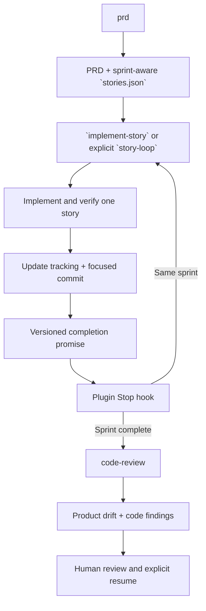

# ai-dev-toolkit

Personal Codex skills for moving from product requirements to reviewed implementation.

The repository is also a Codex plugin. Its manifest is `.codex-plugin/plugin.json`; Codex discovers
the bundled skills under `skills/` and the lifecycle hook under `hooks/hooks.json`.

## Skills

| Skill | Purpose |
|---|---|
| `prd` | Create comprehensive or focused PRDs and decompose them into sprint-aware stories. |
| `implement-story` | Implement and verify one story without automatic continuation or commits. |
| `story-loop` | Explicitly implement, track, and commit one story, then signal the Stop hook. |
| `code-review` | Review product alignment and implementation quality, then stop for a human. |
| `doc-coauthoring` | Co-author documentation through context, refinement, and reader testing. |

`templates/AGENTS.md` contains personal coding preferences that can be installed separately as
global guidance. `templates/CLAUDE.md` is the corresponding Claude Code symlink template.

## Story Workflow



Start the loop explicitly:

```text
$story-loop US-001
```

`story-loop` is explicit-only because it authorizes a commit and automatic continuation. It checks
that the current branch matches `stories.json`, but it never creates or switches branches. Each
successful iteration ends with a versioned `STORY_COMPLETE` promise. The Stop hook validates that
the named story exists and is passing, then either selects the next unfinished story in the same
sprint or invokes `$code-review`.

Code review is mandatory after every sprint, including the final sprint. It reports prioritized
implementation findings and a separate mandatory product-alignment assessment, emits no completion
promise, and stops. Resume only after the human has inspected the findings and reviewed diff.

## Git Policy

Use one feature branch for the complete PRD. `stories.json` records a suggested `branchName`; the
default naming fallback is `feature/<kebab-case-slug>`, without an agent-specific prefix. The user
creates or selects that branch separately before starting the loop.

The loop treats `branchName` as an assertion: it stops if the current branch does not match and never
manages branches. A first run may include newly generated planning artifacts under `tasks/` in the
first story commit; any unrelated dirty path stops the loop.

Each story produces one focused commit with a conventional, repository-appropriate message. The
harness adds no story prefix, ID, or trailer:

```text
Add configurable retry behavior

Explain the user-visible behavior when useful.
```

Story-to-commit traceability comes from `stories.json`, `progress.txt`, and one-story-per-commit
ordering. Squash-merge remains an option when the public/default-branch history should contain one
clean feature commit, but it is no longer needed to hide harness-specific metadata.

## Evolving Requirements

The product-alignment review may propose PRD or story changes but never applies them automatically.
The loop always stops at that point. If the human accepts a change in direction:

1. Explicitly invoke `$prd` (or edit the planning artifacts directly) to update the PRD and record
   the material decision.
2. Revise only unfinished stories and recalculate their order and sprint assignment.
3. Preserve completed stories as historical records; add a corrective story when shipped behavior
   must change.
4. Explicitly resume `$story-loop` after accepting the revised plan.

This revision workflow is intentionally outside the PRD skill's normal generation/decomposition
path. You can also invoke `$code-review` manually during a sprint for an early drift check. The
custom review follows the same visible principles as Codex's native `/review`—an explicit diff
scope, concise actionable findings, and no working-tree changes—while adding PRD alignment and the
sprint checkpoint.

## Hook Portability

The plugin hook runs:

```text
uv run --script "${PLUGIN_ROOT}/hooks/stop_continue.py"
```

`${PLUGIN_ROOT}` works from the installed plugin location, `--script` keeps the hook independent of
the target project's environment, and `uv` provides the same Python entry point on Linux, macOS,
and Windows. Target repositories do not need to copy repo-local hook files.
Installed plugin hooks must be reviewed and trusted in Codex before they run.

## Development

Run the hook tests:

```text
python -m unittest tests.test_stop_continue -v
```

Validate a skill with the bundled skill creator and PyYAML supplied by `uv`:

```text
uv run --with pyyaml python <skill-creator>/scripts/quick_validate.py skills/<skill-name>
```

Validate the plugin with the bundled plugin creator:

```text
uv run --with pyyaml python <plugin-creator>/scripts/validate_plugin.py .
```
