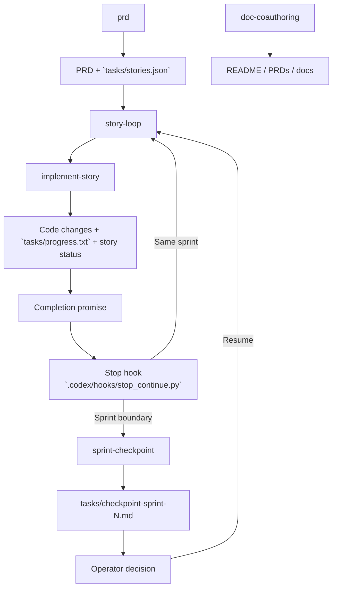

# ai-dev-toolkit

Personal Claude Code and OpenAI Codex configuration and skills.

The `templates/AGENTS.md` file contains global coding preferences and tooling rules that apply across all projects. `templates/CLAUDE.md` is setup as a symbolic link for Claude Code.

## Skills

| Skill | Description |
|-------|-------------|
| `prd` | Create Product Requirements Documents (comprehensive or focused) and decompose them into a `stories.json` file of implementation-ready user stories. |
| `implement-story` | Implement a single user story end-to-end: reads requirements from `tasks/stories.json`, writes code, runs quality checks, and proposes a commit unless the user explicitly asks it to commit. |
| `story-loop` | Thin wrapper around `implement-story` for interactive, hook-driven story-by-story execution. It commits on success and ends with a story-ID-aware completion promise consumed by the Stop hook. |
| `sprint-checkpoint` | Review a completed sprint against the PRD, stories, progress log, and relevant code, then write `tasks/checkpoint-sprint-N.md` for operator review. |
| `doc-coauthoring` | Structured three-stage workflow for co-authoring docs (context gathering → refinement → reader testing). Copied as-is from [Anthropic's skills repo](https://github.com/anthropics/skills). |

## How It Fits Together

The core loop is: define the work with `prd`, execute one story at a time with `story-loop`, let
the repo-local Stop hook decide whether to continue or pause at a sprint boundary, and use
`sprint-checkpoint` to produce an operator-facing review before resuming. `doc-coauthoring` sits
alongside that loop as the documentation lane for keeping README files, PRDs, and related docs in
good shape.



## Interactive Story Loop

This is my own sprint-aware take on the "Ralph Wiggum" loop.

For repos that include the repo-local Codex hook scaffolding:

- `.codex/hooks.json`
- `.codex/hooks/stop_continue.py`

Start the loop manually with the first story:

```text
$story-loop US-001
```

The `story-loop` skill wraps `implement-story`, commits successful work, and ends with a completion
promise that includes the completed story ID. When that promise appears, the hook reads
`tasks/stories.json`, decides whether the completed story finished its sprint, and then either
continues with another `$story-loop ...` prompt or pauses with `$sprint-checkpoint ...`.

Today this repo keeps the hook scaffolding outside a plugin because Codex plugins do not yet document plugin-level hook definitions. Once Codex plugins support hooks, this setup can be packaged end-to-end and the remaining manual repo-local hook wiring can disappear; `story-loop` is already the thin skill layer that would fit naturally into that packaged version.
